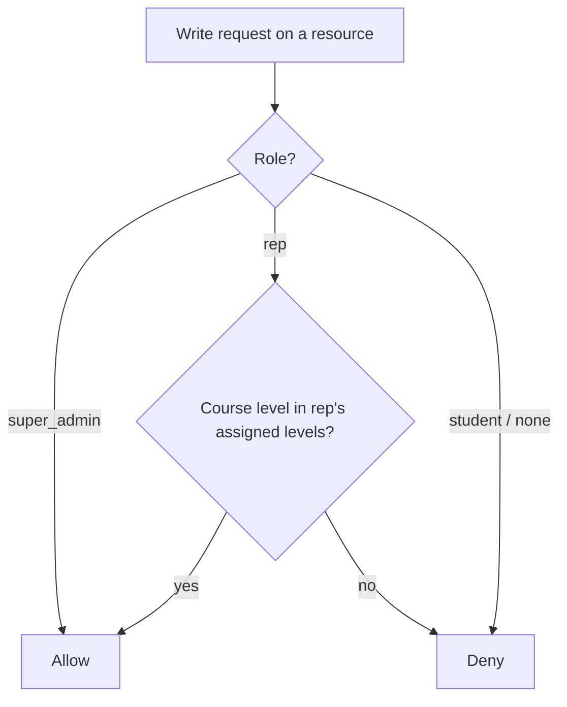
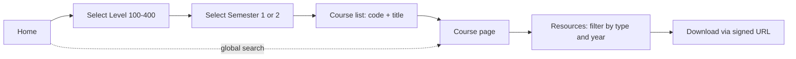
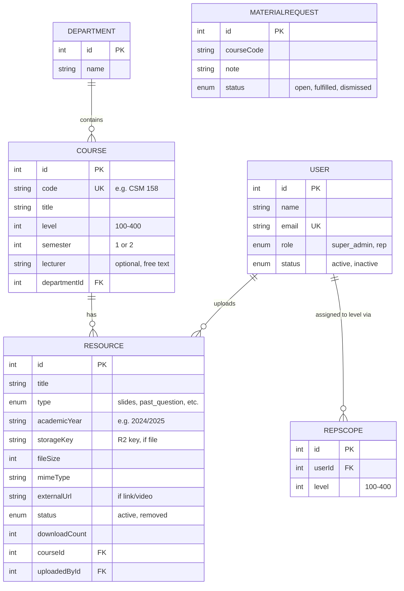
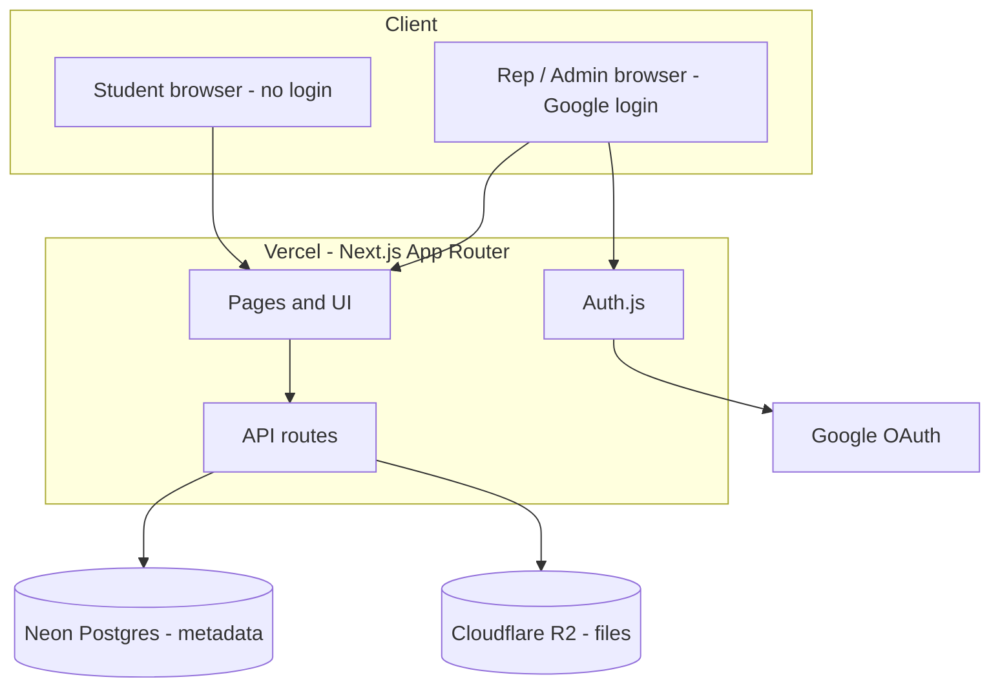
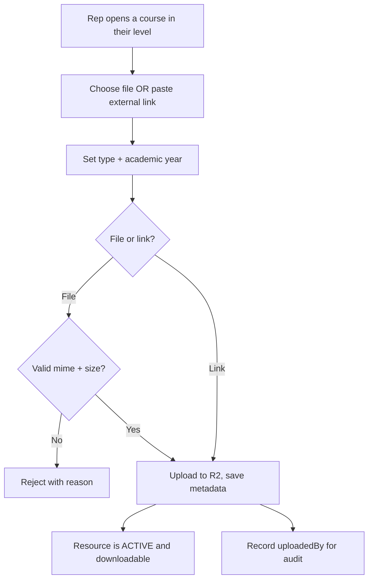
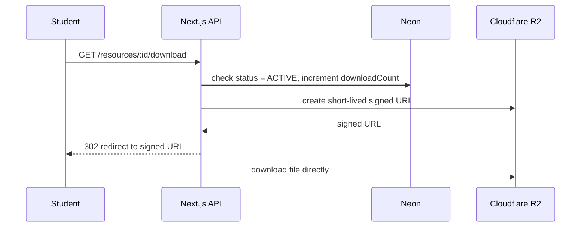

# CS Resource Hub — System Design & Build Plan

> **Working title — rename to whatever your department prefers.**
> A centralized, searchable library of academic materials for a single university department, replacing the "search WhatsApp forever" workflow.

**Version:** 1.0 · **Scope:** KNUST Computer Science Department, Levels 100–400
**Team:** 2 founders (super-admins) + course reps (uploaders) · **Build method:** AI agents
**Budget:** GHS 0 / month (all free tiers)

---

## 1. Executive Summary

Course reps already collect and share every slide, note, past question, and assignment inside per-class WhatsApp groups. That content is impossible to search, expires, and is invisible to new students. This platform becomes the **single, searchable, permanent home** for those same materials.

The design is deliberately small. It is **not** a Moodle/Canvas clone. It is a fast, public, read-only library that the people who already do the work (course reps) keep filled, with the two founders sitting above them as moderators. Everything that would add cost, complexity, or risk without earning its place today has been cut and listed explicitly as a non-goal.

The guiding principle throughout: **spend design effort only on the decisions that are expensive to reverse** (data model, storage, access model). Everything else is deferred until real usage proves it is needed.

---

## 2. Goals & Non-Goals

### Goals
- A student finds any material for their level in **three taps** (Level → Semester → Course) or one search, without an account.
- Course reps upload as easily as dropping a file in a group chat — but only within the level they represent.
- The two founders can moderate, recover, and manage structure without touching every file.
- Runs permanently on free tiers.
- Clean enough on a phone and light enough on mobile data that Ghanaian students actually prefer it to WhatsApp.

### Non-Goals (things we are consciously NOT building yet)
- **No student accounts.** Reading and downloading are public.
- **No video/large-file hosting.** Videos are stored elsewhere and linked (see §9).
- **No lecturer accounts or dashboards.** Lecturer is just a text field on a course.
- **No approval/moderation queue.** Reps are trusted; the founders' soft-delete is the backstop.
- **No multi-university / multi-tenant product.** One department. (One future-proofing column only — see §5.)
- **No monetization, no mobile app, no notifications, no offline mode** — deferred to "if it proves useful."

---

## 3. Users & Roles

Three tiers. The critical correction to "reps are admins": **reps are *scoped uploaders*, not admins.** A rep can only write within the level(s) they represent, so no single rep can damage the whole department, and reps can be rotated out safely each year.

| Role | Accounts? | Can read | Can upload | Scope of write | Can manage structure / users |
|------|-----------|----------|------------|----------------|------------------------------|
| **Student** | No | ✅ active resources | ❌ | — | ❌ |
| **Course Rep** | Yes (Google) | ✅ | ✅ | **only courses in their assigned level(s)** | ❌ |
| **Super-Admin** (the 2 founders) | Yes (Google) | ✅ | ✅ | everything | ✅ |

**The entire permission system in one sentence:**
> Super-admins may do anything; a rep may create/edit/soft-delete resources only on courses whose level is in their assigned levels; students read active resources and submit material requests.



**Rep scope granularity:** we use **level-based scope** (a rep owns Level 100, etc.), because that mirrors the existing per-class WhatsApp groups and keeps assignment overhead tiny. If a single level ever has multiple reps who shouldn't overlap, tighten to course-level scope later — the data model already supports it.

---

## 4. Information Architecture & Navigation

The student's path is a direct reflection of the data model — no folders, just structured metadata:



Global search runs across course code, course title, resource title, type, and academic year — all structured fields, so search is just filtering, not a search engine to operate. **This clean navigation is the platform's only real advantage over a shared Google Drive, so it is where build effort should concentrate.**

---

## 5. Data Model

One deliberate simplification from earlier drafts: we do **not** use a `CourseOffering` entity. With no enrollment, no lecturer accounts, and no scheduling in scope, it is over-engineering. Instead, a **Course is a permanent catalog entry** (it exists once, forever) and yearly variation lives as `academicYear` **metadata on each Resource**. This is how a library actually works: 2025's past questions and 2026's updated slides coexist under the same course, filterable by year, and the rep just picks a year at upload instead of navigating an entity tree.



**Why `MaterialRequest` exists:** since students can't upload, this one-tap "I'm looking for X and it's not here" button is how you *learn what's missing*. It is not an upload — it is your coverage radar, and it directly fights the platform's biggest failure mode (a student finds nothing and returns to WhatsApp).

**The one future-proofing decision:** `Department` is a real table and `Course.departmentId` exists, even though there is exactly one department today. That is one cheap column that keeps multi-department expansion possible *without building any department-management feature now.* That is the correct amount of future-proofing: a column, not a subsystem.

(Full Prisma schema in Appendix A.)

---

## 6. System Architecture



**Stack (chosen for AI-agent buildability — boring, typed, mainstream):**

| Layer | Choice | Why |
|-------|--------|-----|
| Framework | **Next.js (App Router) + TypeScript** | One codebase for UI + API; agents generate it reliably |
| Validation | **Zod** | Every input validated; kills whole classes of bugs |
| ORM / DB | **Prisma + Neon Postgres** | Parameterized queries (no SQLi); free tier |
| File storage | **Cloudflare R2** | Zero egress fees; free tier; S3-compatible |
| Auth | **Auth.js + Google** | No passwords to leak; reps sign in with Google/KNUST email |
| Hosting | **Vercel (Hobby)** | Free for non-commercial; zero-config deploys |

---

## 7. Key Workflows

### 7.1 Upload (rep or admin)



Reps see only courses in their assigned levels. Type and academic year are **required, structured fields** (not free text) — this keeps the library clean and makes search work.

### 7.2 Download (any visitor)

Files are never public. Every download is a short-lived signed URL, so links can't be shared permanently or scraped in bulk.



**Data-conscious touch (important for the Ghanaian student context):** always show the **file size next to every download button** so a student on limited mobile data can decide before spending it.

### 7.3 Rep offboarding (yearly turnover)

Reps rotate every academic year. Deactivating a rep sets `User.status = INACTIVE` — this revokes their login but **keeps every file they uploaded** (`uploadedBy` and the resources remain). Never hard-delete a user or their content.

---

## 8. Security

The threat model that actually matters here — not a generic OWASP checklist, but the real surface for *this* app once reps (a rotating, semi-trusted group) can upload:

| Threat | Mitigation |
|--------|------------|
| **Broken access control / IDOR** | Server-side scope check on every write: `super_admin` OR (`rep` AND `resource.course.level ∈ rep.scopes`). Never trust a role sent from the client. |
| **Malicious file uploads** | Whitelist mime types + cap file size **server-side**; store originals in R2 and never execute them; serve only via short-lived signed URLs from a separate domain. Optional async malware scan. |
| **Rep account compromise** (you know this risk first-hand) | Google OAuth = no password to phish; instant deactivation via status flag; full audit trail via `uploadedBy`. |
| **Copyright liability** (now spread across all reps) | Upload-time acknowledgment ("only share materials you're permitted to"); audit trail; founder soft-delete/takedown as backstop. Prefer lecturer-produced material + past questions; avoid wholesale publisher textbooks. |
| **SQL injection** | Prisma parameterizes all queries. |
| **Input tampering / mass assignment** | Zod validates and whitelists every field on every endpoint. |
| **Abuse of public endpoints** | Rate-limit the download and material-request endpoints. |

**Soft-delete everywhere.** `Resource.status` and `User.status` mean an accident or a takedown is one toggle, never lost data.

---

## 9. Storage Strategy & the 10 GB Rule

- **Metadata → Neon Postgres.** A whole department is a few thousand rows — far under the free tier's 0.5 GB per project.
- **Files → Cloudflare R2.** Free tier: **10 GB storage, ~10M reads/month, zero egress fees, permanently.** Zero egress is exactly right for a download-heavy app.
- **Hard rule: do NOT host videos or large files.** 10 GB covers a department's PDFs comfortably, but one semester of recorded lectures would blow past it instantly — and Cloudflare's terms prohibit video hosting anyway. So a "video" or "recording" resource is an **external link** (`externalUrl` → unlisted YouTube / Google Drive), never a stored file.

The **10 GB R2 cap is your natural "it's useful, time to invest" trigger** — the first thing that will ever cost money, and only once real adoption fills it. That matches your scale-if-it-works philosophy exactly.

---

## 10. Budget (GHS 0 / month)

| Service | Tier | Free allowance | What to watch |
|---------|------|----------------|---------------|
| Vercel | Hobby | Free (non-commercial) | Commercial use later needs Pro |
| Neon Postgres | Free | 0.5 GB/project, scale-to-zero | Cold-start ~few hundred ms after idle |
| Cloudflare R2 | Free | 10 GB, ~10M reads/mo, zero egress | **Storage → the 10 GB cap** |
| Auth.js + Google | — | Free | — |

**Total recurring cost: 0.** The only future cost trigger is R2 storage crossing 10 GB.

---

## 11. Search

No search engine needed. All searchable data is structured, so search is filtering over Postgres:

- Facets: **level, semester, course code/title, type, academic year.**
- Free-text: match on course code, course title, resource title.
- Add a Postgres GIN index / `pg_trgm` for fuzzy title search only if simple `ILIKE` proves too slow — unlikely at department scale.

---

## 12. MVP vs Later

### MVP (build this first)
1. Seed the department: all Levels 100–400, both semesters, every course (code + title). **This backbone must exist before anything else.**
2. Public browse (Level → Semester → Course → Resources) + filters + global search.
3. Signed-URL downloads with size shown and download counting.
4. Rep/admin Google login + scoped upload (file or link) + soft-delete.
5. "Request material" button feeding `MaterialRequest`.
6. Founder admin: add/edit courses, add reps + assign levels, deactivate reps, moderate resources.

**MVP success test:** seed **one level** with real content to ~90% coverage and check whether that class's WhatsApp "does anyone have X?" questions drop. That single signal validates the whole idea before you scale content to all four levels.

### Version 2 (once MVP is used)
- Download analytics surfaced to admins; duplicate-upload hints; bulk upload; bookmarks (local, no account).

### Future (only if genuinely useful)
- Notifications; multi-department; PWA/offline; AI search/summarization.

---

## 13. Risks & Mitigations

| Risk | Likelihood | Mitigation |
|------|-----------|------------|
| **Staleness** — reps get busy at exam time, content dries up, students leave | High | Fast bulk upload; `MaterialRequest` shows demand; founders backfill hot courses |
| **Empty-library cold start** across 4 levels | High | Reps distribute the work (this is *why* rep-upload beats founder-only); seed one level fully first |
| **Copyright takedown** | Medium | Audit trail + soft-delete + takedown path; avoid publisher textbooks |
| **Rep account compromised / bad file** | Medium | OAuth, server-side validation, signed URLs, instant deactivation |
| **"Why not just use Google Drive?"** | Medium | Win on search + clean mobile UX; if you can't beat Drive's experience, the project has no reason to exist — so invest there |
| **Outgrowing 10 GB free tier** | Low (at first) | Videos are links, not files; treat the cap as the invest-now signal |

---

## 14. Build Roadmap (2 people + AI agents)

| Phase | Deliverable | Done when |
|-------|-------------|-----------|
| **0 — Foundation** | Prisma schema + migrations + seeded course catalog (all levels) | You can browse an empty-but-complete course tree |
| **1 — Public read** | Browse, filter, search, signed-URL download, size display | A student finds and downloads a file in 3 taps, no login |
| **2 — Rep write** | Google auth, scoped upload (file + link), soft-delete, audit | A Level-100 rep uploads to a Level-100 course and nowhere else |
| **3 — Founder tools** | Course/rep management, moderation, `MaterialRequest` inbox | You can onboard/offboard a rep and take down a file |
| **4 — Pilot** | One level seeded to ~90% coverage; measure WhatsApp question drop | The success test in §12 passes |

Then, and only then, expand content to all four levels and revisit Version 2.

---

## Appendix A — Prisma Schema

```prisma
generator client {
  provider = "prisma-client-js"
}

datasource db {
  provider = "postgresql"
  url      = env("DATABASE_URL")
}

enum Role {
  SUPER_ADMIN
  REP
}

enum UserStatus {
  ACTIVE
  INACTIVE
}

enum ResourceType {
  SLIDES
  NOTES
  PAST_QUESTION
  ASSIGNMENT
  SOLUTION
  LAB_MANUAL
  BOOK
  OUTLINE
  TIMETABLE
  LINK
  OTHER
}

enum ResourceStatus {
  ACTIVE
  REMOVED
}

enum RequestStatus {
  OPEN
  FULFILLED
  DISMISSED
}

model Department {
  id        Int      @id @default(autoincrement())
  name      String   @unique
  courses   Course[]
  createdAt DateTime @default(now())
}

model Course {
  id           Int        @id @default(autoincrement())
  code         String     @unique // e.g. "CSM 158"
  title        String
  level        Int        // 100, 200, 300, 400
  semester     Int        // 1 or 2
  lecturer     String?    // free text, optional
  departmentId Int
  department   Department @relation(fields: [departmentId], references: [id])
  resources    Resource[]
  createdAt    DateTime   @default(now())

  @@index([level, semester])
}

model Resource {
  id            Int            @id @default(autoincrement())
  title         String
  type          ResourceType
  academicYear  String?        // e.g. "2024/2025"
  // Exactly one of the file-block OR externalUrl is set:
  storageKey    String?        // R2 object key
  fileSize      Int?           // bytes
  mimeType      String?
  externalUrl   String?        // videos / big files / links
  status        ResourceStatus @default(ACTIVE)
  downloadCount Int            @default(0)
  courseId      Int
  course        Course         @relation(fields: [courseId], references: [id])
  uploadedById  Int
  uploadedBy    User           @relation(fields: [uploadedById], references: [id])
  createdAt     DateTime       @default(now())

  @@index([courseId, type])
  @@index([academicYear])
}

model User {
  id        Int        @id @default(autoincrement())
  name      String
  email     String     @unique
  role      Role
  status    UserStatus @default(ACTIVE)
  scopes    RepScope[]
  resources Resource[]
  createdAt DateTime   @default(now())
}

model RepScope {
  id     Int  @id @default(autoincrement())
  userId Int
  user   User @relation(fields: [userId], references: [id])
  level  Int  // 100–400

  @@unique([userId, level])
}

model MaterialRequest {
  id         Int           @id @default(autoincrement())
  courseCode String?
  note       String
  status     RequestStatus @default(OPEN)
  createdAt  DateTime      @default(now())

  @@index([status])
}
```

---

## Appendix B — Core REST Endpoints

**Public (no auth):**
- `GET /api/courses?level=&semester=` — list courses
- `GET /api/courses/:code` — course detail
- `GET /api/courses/:code/resources?type=&year=` — resources for a course
- `GET /api/resources/:id/download` — verify active, increment count, return/redirect to signed URL
- `POST /api/requests` — submit a material request

**Rep / Admin (auth + scope check):**
- `POST /api/resources` — multipart (file → validate → R2) or link; sets `uploadedBy`
- `PATCH /api/resources/:id` — edit metadata (scope-checked)
- `DELETE /api/resources/:id` — soft-delete (`status = REMOVED`, scope-checked)

**Super-Admin only:**
- `POST /api/courses`, `PATCH /api/courses/:id`
- `POST /api/users` — add rep + assign level scopes
- `PATCH /api/users/:id` — deactivate rep / change scopes
- `GET /api/requests` — material-request inbox; `PATCH /api/requests/:id` — resolve

Every write endpoint enforces: `role === SUPER_ADMIN` **OR** (`role === REP` **AND** target course level ∈ rep's scopes). All bodies validated with Zod.

---

*This is a living document. Refine it as the pilot teaches you what students and reps actually do.*
