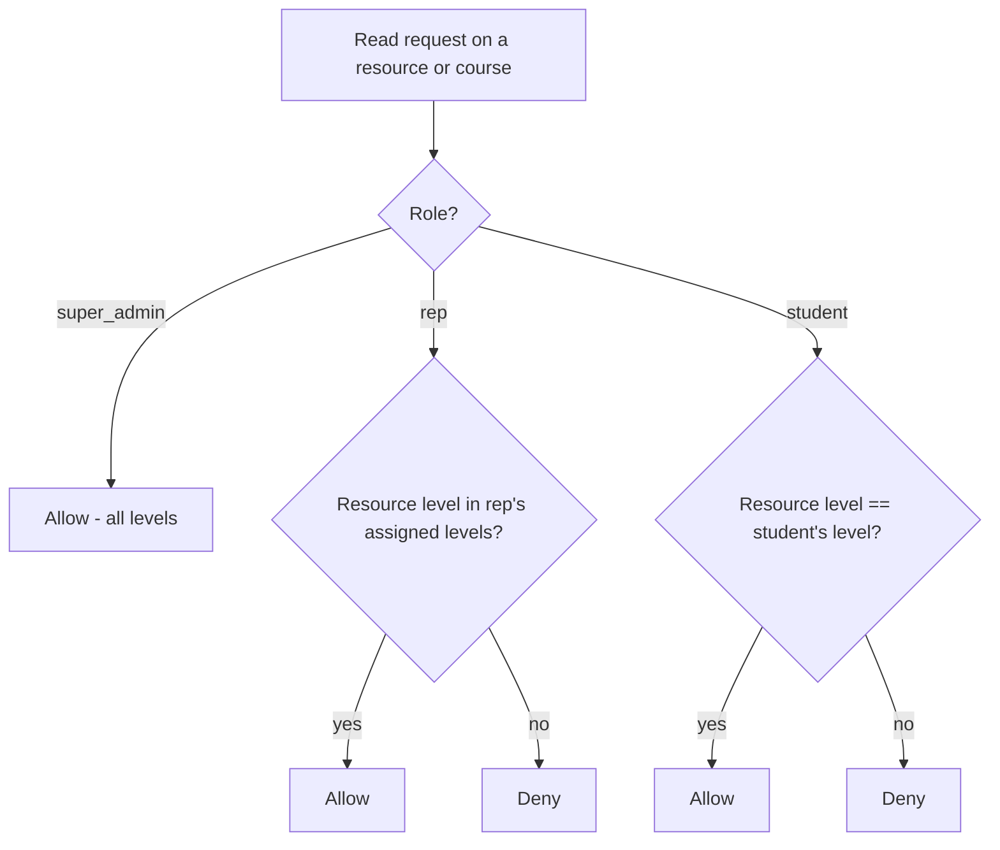
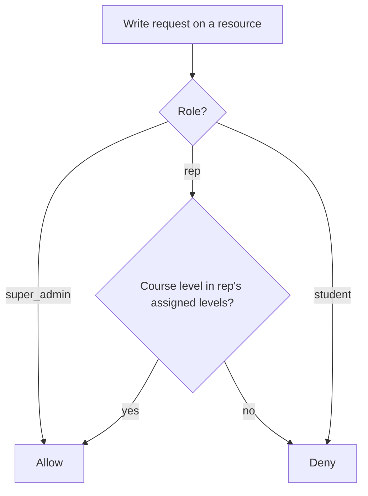
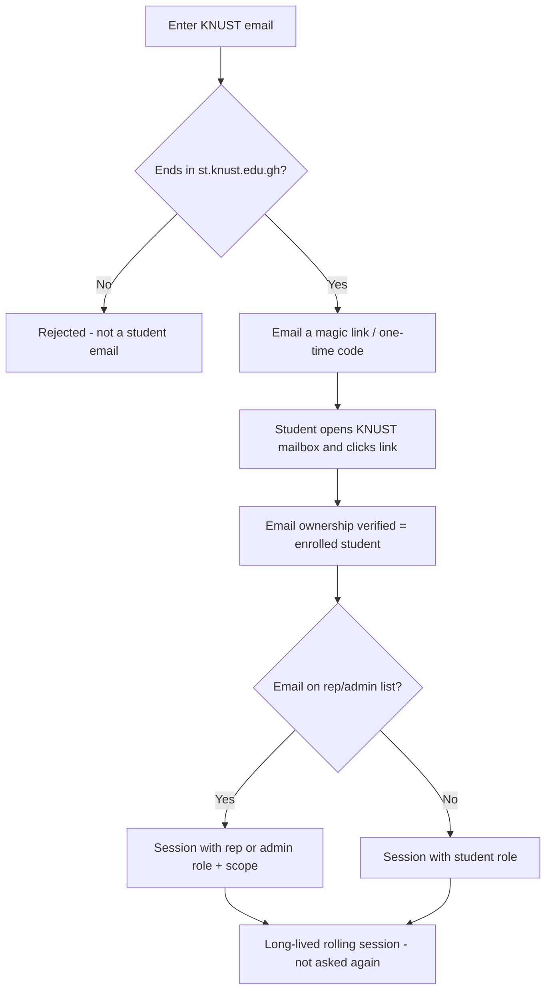
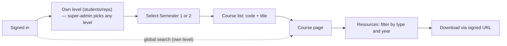
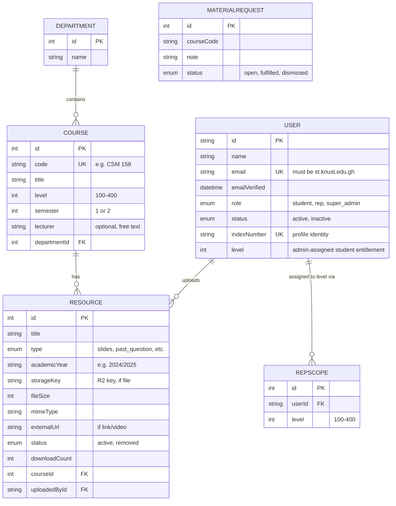
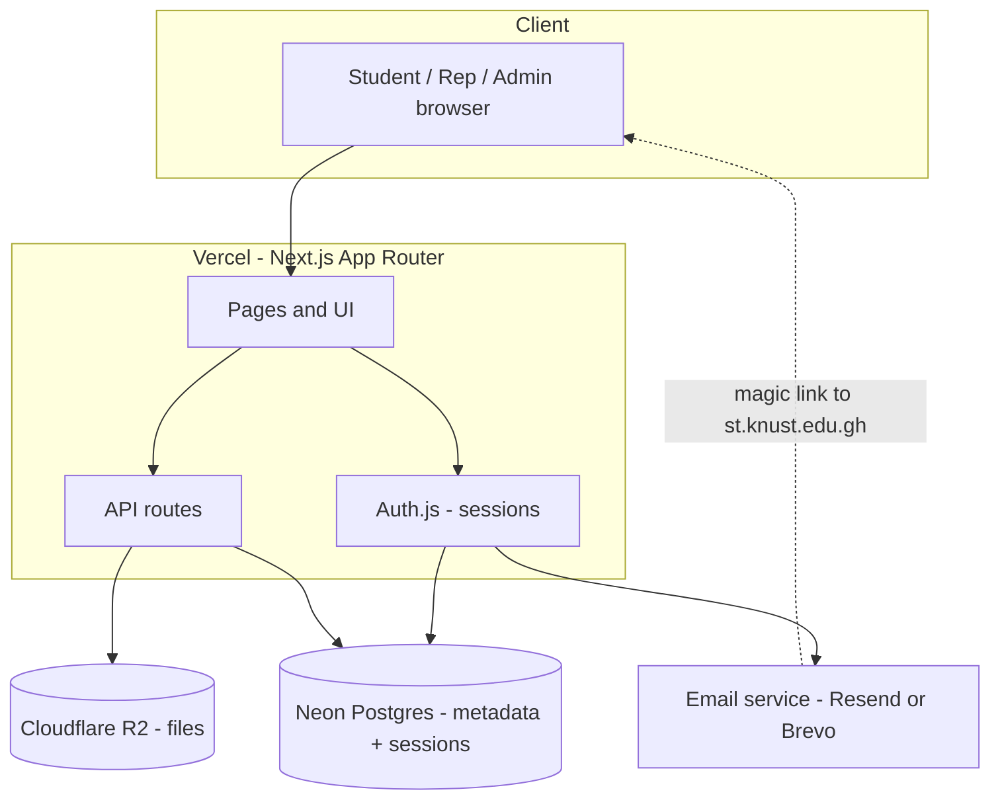
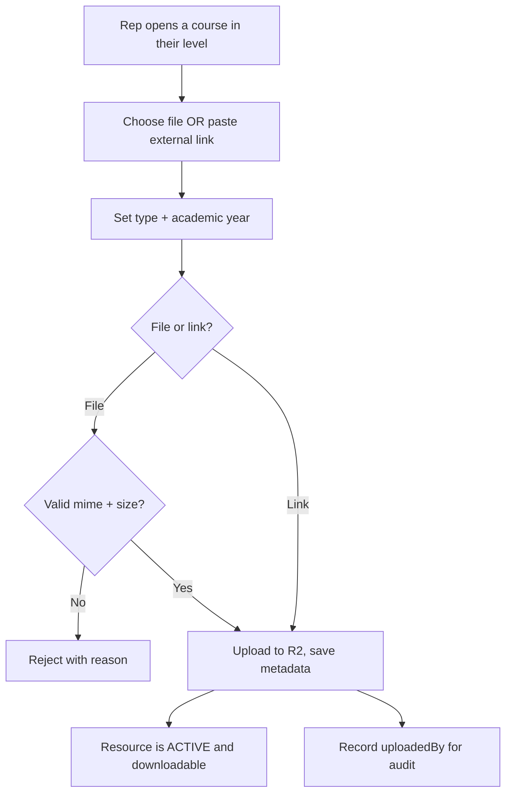
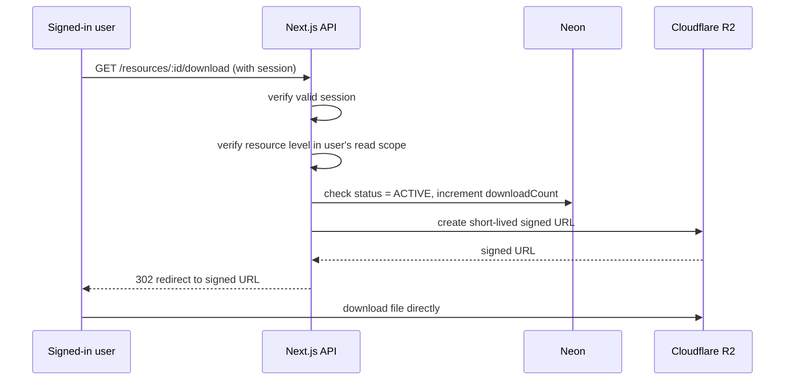

# CS Resource Hub — System Design & Build Plan

> **Working title — rename to whatever your department prefers.**
> A centralized, searchable library of academic materials for a single university department, replacing the "search WhatsApp forever" workflow.

**Version:** 1.2 · **Scope:** KNUST Computer Science Department, Levels 100–400
**Team:** 2 founders (super-admins) + course reps (uploaders) · **Build method:** AI agents
**Budget:** GHS 0 / month (all free tiers)

### Changelog (v1.1 → v1.2)
- **Reads are now LEVEL-SCOPED (Option B).** A signed-in **Student** or **Course Rep** sees only their **own level's** courses and resources; **Super-Admins** see all levels. Previously reads were open across all levels — that is now changed by design. Writes remain level-scoped for reps. Enforced **server-side**, not just hidden in the UI.
- All affected sections (Goals, §3 Roles, §4 auth flow, §5 navigation, §8 download, §10 security, §12 search, Appendix B endpoints) updated to match.

### Changelog (v1.0 → v1.1)
- **Access is now authenticated, not public.** Students sign in before reading/downloading — a stronger copyright posture and the tutor-requested model.
- **Login is by KNUST student email, no passwords.** Because KNUST email runs on **Zimbra** (not Google/Microsoft, so no OAuth button), verification is done with an **emailed magic link / one-time code** to the `@st.knust.edu.gh` address. Same goal — verified students, zero passwords — achievable without OAuth.
- **Sessions handled by Auth.js**, not hand-rolled tokens: long-lived, auto-renewing, so students sign in once.
- **Index number** is captured as profile identity (auto-routes a student to their level); the *email* is the actual enrolment gate.
- Data model, workflows, security, budget, and roadmap updated to match.

---

## 1. Executive Summary

Course reps already collect and share every slide, note, past question, and assignment inside per-class WhatsApp groups. That content is impossible to search, expires, and is invisible to new students. This platform becomes the **single, searchable, permanent home** for those same materials — accessible only to verified KNUST students.

The design is deliberately small. It is **not** a Moodle/Canvas clone. It is a fast, students-only, read-oriented library that the people who already do the work (course reps) keep filled, with the two founders sitting above them as moderators. Everything that would add cost, complexity, or risk without earning its place today has been cut and listed explicitly as a non-goal.

Guiding principle: **spend design effort only on decisions that are expensive to reverse** (data model, storage, access model). Everything else is deferred until real usage proves it is needed.

---

## 2. Goals & Non-Goals

### Goals
- A signed-in student finds any material for **their own level** in **three taps** (Level → Semester → Course) or one search. Students and reps see only their own level; super-admins see all levels.
- **Access is restricted to verified KNUST students** via their institutional email — no passwords stored, and students sign in only once thanks to long-lived sessions.
- Course reps upload as easily as dropping a file in a group chat — but only within the level they represent.
- The two founders can moderate, recover, and manage structure without touching every file.
- Runs permanently on free tiers.
- Clean on a phone and light on mobile data, so students prefer it to WhatsApp.

### Non-Goals (consciously NOT building yet)
- **No anonymous/public access.** Reading requires a verified KNUST student login.
- **No passwords.** Identity is proven by control of a KNUST mailbox (magic link / OTP).
- **No video/large-file hosting.** Videos are stored elsewhere and linked (see §9).
- **No lecturer accounts or dashboards.** Lecturer is just a text field on a course.
- **No approval/moderation queue.** Reps are trusted; the founders' soft-delete is the backstop.
- **No multi-university / multi-tenant product.** One department. (One future-proofing column only — see §5.)
- **No monetization, no mobile app, no notifications, no offline mode** — deferred to "if it proves useful."

---

## 3. Users & Roles

Everyone signs in with the **same mechanism** — a KNUST student email magic link. What differs is the **role** attached to that email. Reps and super-admins are simply students whose email has been granted extra powers.

The critical distinction: **reps are *scoped uploaders*, not admins.** A rep can only write within the level(s) they represent, so no single rep can damage the whole department, and reps can be rotated out safely each year.

| Role | Sign-in | Can read | Read scope | Can upload | Scope of write | Manage structure / users |
|------|---------|----------|------------|------------|----------------|--------------------------|
| **Student** | KNUST email magic link | ✅ (signed in) | **own level only** | ❌ | — | ❌ |
| **Course Rep** | KNUST email magic link | ✅ | **own assigned level(s) only** | ✅ | **only courses in their assigned level(s)** | ❌ |
| **Super-Admin** (2 founders) | KNUST email magic link | ✅ | **all levels** | ✅ | everything | ✅ |

**The permission system in three sentences:**
> Reading requires a valid session **and** that the resource's level is in scope: a **student** or **rep** may read only their **own level('s)**; a **super_admin** reads all levels. Writing a resource requires `super_admin`, OR `rep` where the course's level is in that rep's assigned levels. Both read-scope and write-scope are enforced **server-side** — the client is never trusted.

A user's read scope is derived from their level: a Student's `level` (from their profile/index number), a Rep's `RepScope` level(s), and unrestricted for Super-Admin.

**Read gate (new in v1.2):**



**Write gate:**



**Rep scope granularity:** **level-based** (a rep owns Level 100, etc.), mirroring the per-class WhatsApp groups and keeping assignment overhead tiny. If one level ever has multiple non-overlapping reps, tighten to course-level scope later — the model already supports it.

---

## 4. Authentication & Sessions

**Why not "Sign in with Google/Microsoft":** KNUST student mail runs on **Zimbra** (self-hosted, `stdmail.knust.edu.gh`, `@st.knust.edu.gh` addresses). Zimbra exposes no OAuth login, so there is no institutional "sign in with…" button to use.

**The mechanism that still achieves your goal — verified students, no passwords:**



- **Provider:** Auth.js **Email (passwordless) provider**, restricted to the `@st.knust.edu.gh` domain at sign-in. Control of a KNUST mailbox = proof of enrolment, since only KNUST issues those addresses.
- **Sessions:** managed by Auth.js (your "ship securely & fast" choice) — a long `maxAge` with rolling renewal means one sign-in lasts. **No hand-rolled access/refresh tokens**, so none of the token-rotation footguns.
- **Role resolution & read scope:** on login, the email is checked against the rep/admin list; otherwise the session is a plain student. The session carries the user's **level scope** — a student's own level, a rep's assigned level(s), or "all" for super-admins — and every read is filtered against it server-side.
- **Index number:** collected once at first login as profile data. A student's level is an **administrator-assigned entitlement** until an authoritative KNUST roster integration exists; never derive authorization from a self-entered index number. The email is the enrolment gate.

> Confirm the exact student email domain before building (expected `@st.knust.edu.gh`). If postgraduate or some cohorts use a different sub-domain, allow those too.

---

## 5. Information Architecture & Navigation

The student's path is a direct reflection of the data model — no folders, just structured metadata:



Students and reps land on — and are confined to — **their own level**: the level switcher shows only their level (a rep with multiple assigned levels sees those). **Super-admins** get the full Level 100–400 switcher. Global search runs across course code, title, resource title, type, and academic year — all structured fields, so search is filtering, not a search engine to operate — and **is itself scoped to the user's readable level(s)**. **This clean navigation is the platform's only real advantage over a shared Google Drive, so it is where build effort should concentrate.**

---

## 6. Data Model

One deliberate simplification: we do **not** use a `CourseOffering` entity. With no enrolment, no lecturer accounts, and no scheduling in scope, it is over-engineering. A **Course is a permanent catalog entry** (it exists once, forever) and yearly variation lives as `academicYear` **metadata on each Resource**. This is how a library actually works: 2025's past questions and 2026's updated slides coexist under one course, filterable by year, and the rep just picks a year at upload.



**Why `MaterialRequest` exists:** the one-tap "I'm looking for X and it's not here" button is how you *learn what's missing*. It's your coverage radar and directly fights the platform's biggest failure mode — a student finding nothing and returning to WhatsApp.

**The one future-proofing decision:** `Department` is a real table and `Course.departmentId` exists, even with exactly one department today. That's one cheap column keeping multi-department expansion possible *without building any department-management feature now.* The correct amount of future-proofing: a column, not a subsystem.

> Auth.js adds its own tables (`Account`, `Session`, `VerificationToken`) and extends `User`. These are included in Appendix A so the schema is build-ready.

---

## 7. System Architecture



**Stack (chosen for AI-agent buildability — boring, typed, mainstream):**

| Layer | Choice | Why |
|-------|--------|-----|
| Framework | **Next.js (App Router) + TypeScript** | One codebase for UI + API; agents generate it reliably |
| Styling | **Tailwind CSS** | Fast, mobile-first, agent-friendly |
| Validation | **Zod** | Every input validated; kills whole classes of bugs |
| ORM / DB | **Prisma + Neon Postgres** | Parameterized queries (no SQLi); free tier; holds metadata + sessions |
| File storage | **Cloudflare R2** | Zero egress fees; free tier; S3-compatible |
| Auth | **Auth.js — Email magic-link, gated to KNUST domain** | Verified students, no passwords, managed sessions |
| Email delivery | **Resend or Brevo (free tier)** | Sends the magic link / OTP |
| Hosting | **Vercel (Hobby)** | Free for non-commercial; zero-config deploys |

---

## 8. Key Workflows

### 8.1 Upload (rep or admin)



Reps see only courses in their assigned levels. Type and academic year are **required, structured fields** (not free text) — this keeps the library clean and makes search work.

### 8.2 Download (signed-in user, in-scope level only)

Files are never public. Every download requires a valid session **and** that the resource's level is in the user's read scope (own level for students/reps; any level for super-admins). Downloads are short-lived signed URLs, so links can't be shared permanently or scraped in bulk.



**Data-conscious touch (important for the Ghanaian student context):** show the **file size next to every download button** so a student on limited mobile data can decide before spending it.

### 8.3 Rep offboarding (yearly turnover)

Reps rotate every academic year. Deactivating a rep sets `User.status = INACTIVE` — revoking their login while **keeping every file they uploaded** (`uploadedBy` and the resources remain). Never hard-delete a user or their content.

---

## 9. Storage Strategy & the 10 GB Rule

- **Metadata + sessions → Neon Postgres.** A whole department plus session rows is a few thousand rows — far under the free tier's 0.5 GB per project.
- **Files → Cloudflare R2.** Free tier: **10 GB storage, ~10M reads/month, zero egress fees, permanently.** Zero egress is exactly right for a download-heavy app.
- **Hard rule: do NOT host videos or large files.** 10 GB covers a department's PDFs comfortably, but one semester of recorded lectures would blow past it — and Cloudflare's terms prohibit video hosting anyway. A "video"/"recording" resource is an **external link** (`externalUrl` → unlisted YouTube / Drive), never a stored file.

The **10 GB R2 cap is your natural "it's useful, time to invest" trigger** — the first thing that will ever cost money, and only once real adoption fills it.

---

## 10. Security

The threat model that actually matters here, now that access is authenticated and reps can upload:

| Threat | Mitigation |
|--------|------------|
| **Unauthorized access** | Every read requires a valid Auth.js session tied to a verified `@st.knust.edu.gh` email. |
| **Cross-level access (reads)** | Every read (list, course, resource, download, search) is filtered **server-side** by the user's read scope: students/reps → own level only; super-admins → all. A student requesting an out-of-level course or resource by direct URL/ID is rejected — never rely on the UI hiding it. |
| **Broken access control / IDOR** | Server-side scope check on every **read and write**: reads verify the resource's level is in the user's read scope; writes require `super_admin` OR (`rep` AND `resource.course.level ∈ rep.scopes`). Never trust a role or level sent by the client. |
| **Malicious file uploads** | Whitelist mime types + cap size **server-side**; store originals in R2 and never execute them; serve only via short-lived signed URLs. Optional async malware scan. |
| **Magic-link / login abuse (spam)** | Rate-limit sign-in requests per email and per IP using a shared production store; short link expiry; single-use tokens. A process-local limiter is development-only. |
| **Untrusted external links** | Permit HTTPS links from an explicit allowlist only; disclose the destination before leaving the platform. |
| **Rep account compromise** | No passwords to phish; instant deactivation via status flag; full audit trail via `uploadedBy`. |
| **Copyright liability** | Now materially reduced: content is behind an enrolled-students-only gate (defensible as an internal resource). Keep upload acknowledgment, audit trail, and founder soft-delete/takedown. Prefer lecturer material + past questions; avoid wholesale publisher textbooks. |
| **SQL injection** | Prisma parameterizes all queries. |
| **Input tampering / mass assignment** | Zod validates and whitelists every field on every endpoint. |

**Soft-delete everywhere.** `Resource.status` and `User.status` mean an accident or takedown is one toggle, never lost data.

---

## 11. Budget (GHS 0 / month)

| Service | Tier | Free allowance | What to watch |
|---------|------|----------------|---------------|
| Vercel | Hobby | Free (non-commercial) | Commercial use later needs Pro |
| Neon Postgres | Free | 0.5 GB/project, scale-to-zero | Cold-start ~few hundred ms after idle |
| Cloudflare R2 | Free | 10 GB, ~10M reads/mo, zero egress | **Storage → the 10 GB cap** |
| Email (Resend/Brevo) | Free | ~3,000/mo (Resend) or ~300/day (Brevo) | Deliverability to KNUST Zimbra (see risks) |
| Auth.js | — | Free | — |

**Total recurring cost: 0.** The only future cost trigger is R2 storage crossing 10 GB.

---

## 12. Search

No search engine needed — all searchable data is structured, so search is filtering over Postgres:

- **Always scoped to the user's readable level(s)** — the level filter is applied server-side and cannot be widened by the client. Students/reps search only their own level; super-admins may search across all.
- Facets: **level, semester, course code/title, type, academic year.**
- Free-text: match on course code, course title, resource title.
- Add a Postgres GIN index / `pg_trgm` for fuzzy title search only if simple `ILIKE` proves too slow — unlikely at department scale.

---

## 13. MVP vs Later

### MVP (build first)
1. Seed the department: all Levels 100–400, both semesters, every course (code + title). **This backbone must exist before anything else.**
2. KNUST-email magic-link login + long-lived sessions + first-login index-number capture.
3. Authenticated browse (Level → Semester → Course → Resources) + filters + global search.
4. Signed-URL downloads with size shown and download counting.
5. Rep/admin scoped upload (file or link) + soft-delete.
6. "Request material" button feeding `MaterialRequest`.
7. Founder admin: add/edit courses, grant rep role + assign levels, deactivate reps, moderate resources.

**MVP success test:** seed **one level** with real content to ~90% coverage and check whether that class's WhatsApp "does anyone have X?" questions drop. That single signal validates the idea before scaling content to all four levels.

### Version 2 (once used)
- Download analytics for admins; duplicate-upload hints; bulk upload; bookmarks.

### Future (only if genuinely useful)
- Notifications; multi-department; PWA/offline; AI search/summarization.

---

## 14. Risks & Mitigations

| Risk | Likelihood | Mitigation |
|------|-----------|------------|
| **Email deliverability to Zimbra / students don't check KNUST mail** | Medium–High | Use a reputable sender with proper SPF/DKIM on your sending domain; test deliverability to `@st.knust.edu.gh` early; offer OTP as well as link; sign-in is one-time thanks to long sessions |
| **Staleness** — reps get busy at exams, content dries up | High | Fast bulk upload; `MaterialRequest` shows demand; founders backfill hot courses |
| **Empty-library cold start** across 4 levels | High | Reps distribute the work (why rep-upload beats founder-only); seed one level fully first |
| **Copyright takedown** | Low–Medium | Enrolled-only gate + audit trail + soft-delete/takedown; avoid publisher textbooks |
| **Rep account misuse / bad file** | Medium | Server-side validation, signed URLs, instant deactivation, audit trail |
| **"Why not just Google Drive?"** | Medium | Win on search + clean mobile UX; if you can't beat Drive's experience, invest there until you do |
| **Outgrowing 10 GB free tier** | Low (at first) | Videos are links, not files; treat the cap as the invest-now signal |

---

## 15. Build Roadmap (2 people + AI agents)

| Phase | Deliverable | Done when |
|-------|-------------|-----------|
| **0 — Foundation** | Prisma schema + migrations + seeded course catalog (all levels) | You can browse an empty-but-complete course tree |
| **1 — Auth + gated read** | KNUST-email magic-link login, sessions, browse, filter, search, signed-URL download, size display | A verified student signs in once and finds/downloads a file in 3 taps |
| **2 — Rep write** | Scoped upload (file + link), soft-delete, audit | A Level-100 rep uploads to a Level-100 course and nowhere else |
| **3 — Founder tools** | Course/rep management, moderation, `MaterialRequest` inbox | You can onboard/offboard a rep and take down a file |
| **4 — Pilot** | One level seeded to ~90% coverage; measure WhatsApp question drop | The success test in §13 passes |

Then, and only then, expand content to all four levels and revisit Version 2.

---

## Appendix A — Prisma Schema

```prisma
generator client {
  provider = "prisma-client-js"
}

datasource db {
  provider = "postgresql"
  url      = env("DATABASE_URL")
}

// ---------- Enums ----------
enum Role {
  STUDENT
  REP
  SUPER_ADMIN
}

enum UserStatus {
  ACTIVE
  INACTIVE
}

enum ResourceType {
  SLIDES
  NOTES
  PAST_QUESTION
  ASSIGNMENT
  SOLUTION
  LAB_MANUAL
  BOOK
  OUTLINE
  TIMETABLE
  LINK
  OTHER
}

enum ResourceStatus {
  ACTIVE
  REMOVED
}

enum RequestStatus {
  OPEN
  FULFILLED
  DISMISSED
}

// ---------- Auth.js adapter models ----------
model User {
  id            String     @id @default(cuid())
  name          String?
  email         String     @unique // enforced @st.knust.edu.gh at sign-in
  emailVerified DateTime?
  image         String?
  role          Role       @default(STUDENT)
  status        UserStatus @default(ACTIVE)
  indexNumber   String?    @unique // profile identity, captured at first login
  accounts      Account[]
  sessions      Session[]
  scopes        RepScope[]
  resources     Resource[]
  createdAt     DateTime   @default(now())
}

model Account {
  // Reserved for future OAuth providers; unused with the Email provider.
  id                String  @id @default(cuid())
  userId            String
  type              String
  provider          String
  providerAccountId String
  refresh_token     String?
  access_token      String?
  expires_at        Int?
  token_type        String?
  scope             String?
  id_token          String?
  session_state     String?
  user              User    @relation(fields: [userId], references: [id], onDelete: Cascade)

  @@unique([provider, providerAccountId])
}

model Session {
  id           String   @id @default(cuid())
  sessionToken String   @unique
  userId       String
  expires      DateTime
  user         User     @relation(fields: [userId], references: [id], onDelete: Cascade)
}

model VerificationToken {
  // Powers the magic-link / OTP flow.
  identifier String
  token      String   @unique
  expires    DateTime

  @@unique([identifier, token])
}

// ---------- Domain models ----------
model Department {
  id        Int      @id @default(autoincrement())
  name      String   @unique
  courses   Course[]
  createdAt DateTime @default(now())
}

model Course {
  id           Int        @id @default(autoincrement())
  code         String     @unique // e.g. "CSM 158"
  title        String
  level        Int        // 100, 200, 300, 400
  semester     Int        // 1 or 2
  lecturer     String?    // free text, optional
  departmentId Int
  department   Department @relation(fields: [departmentId], references: [id])
  resources    Resource[]
  createdAt    DateTime   @default(now())

  @@index([level, semester])
}

model Resource {
  id            Int            @id @default(autoincrement())
  title         String
  type          ResourceType
  academicYear  String?        // e.g. "2024/2025"
  // Exactly one of the file-block OR externalUrl is set:
  storageKey    String?        // R2 object key
  fileSize      Int?           // bytes
  mimeType      String?
  externalUrl   String?        // videos / big files / links
  status        ResourceStatus @default(ACTIVE)
  downloadCount Int            @default(0)
  courseId      Int
  course        Course         @relation(fields: [courseId], references: [id])
  uploadedById  String
  uploadedBy    User           @relation(fields: [uploadedById], references: [id])
  createdAt     DateTime       @default(now())

  @@index([courseId, type])
  @@index([academicYear])
}

model RepScope {
  id     Int    @id @default(autoincrement())
  userId String
  user   User   @relation(fields: [userId], references: [id])
  level  Int    // 100–400

  @@unique([userId, level])
}

model MaterialRequest {
  id         Int           @id @default(autoincrement())
  courseCode String?
  note       String
  status     RequestStatus @default(OPEN)
  createdAt  DateTime      @default(now())

  @@index([status])
}
```

---

## Appendix B — Core Endpoints

**Auth (handled by Auth.js):**
- `/api/auth/*` — sign-in (email magic link), callback, sign-out, session. Domain gate (`@st.knust.edu.gh`) enforced in the sign-in callback.

**Authenticated — any signed-in user, filtered to their read scope:**
- `GET /api/courses?level=&semester=` — list courses. **The `level` filter is clamped server-side to the user's readable level(s); a student/rep cannot list another level even by passing `level=` explicitly. Super-admins may pass any level.**
- `GET /api/courses/:code` — course detail. **Returns 403/404 if the course's level is outside the user's read scope.**
- `GET /api/courses/:code/resources?type=&year=` — resources for a course. **Same level-scope gate.**
- `GET /api/resources/:id/download` — verify session **+ resource level in read scope** + active, increment count, redirect to signed URL.
- `GET /api/search?q=` — scoped search; results limited to the user's readable level(s).
- `POST /api/requests` — submit a material request.
- `PATCH /api/me` — set/update index number (first-login onboarding).

**Rep / Admin (auth + scope check):**
- `POST /api/resources` — multipart (file → validate → R2) or link; sets `uploadedBy`
- `PATCH /api/resources/:id` — edit metadata (scope-checked)
- `DELETE /api/resources/:id` — soft-delete (`status = REMOVED`, scope-checked)

**Super-Admin only:**
- `POST /api/courses`, `PATCH /api/courses/:id`
- `PATCH /api/users/:id` — grant rep role + assign level scopes / deactivate
- `GET /api/requests` — material-request inbox; `PATCH /api/requests/:id` — resolve

Every **read** enforces: valid session **AND** the target's level ∈ the user's read scope (own level for student/rep; all for super_admin). Every **write** enforces: `role === SUPER_ADMIN` **OR** (`role === REP` **AND** target course level ∈ rep's scopes). Never trust a client-supplied role or level. All bodies validated with Zod.

---

*This is a living document. Refine it as the pilot teaches you what students and reps actually do.*
